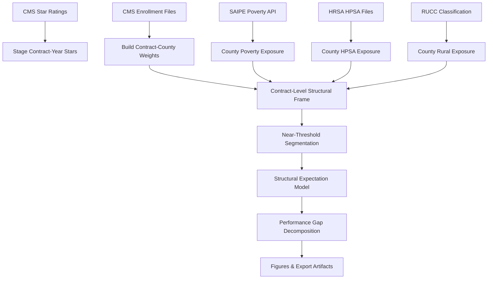
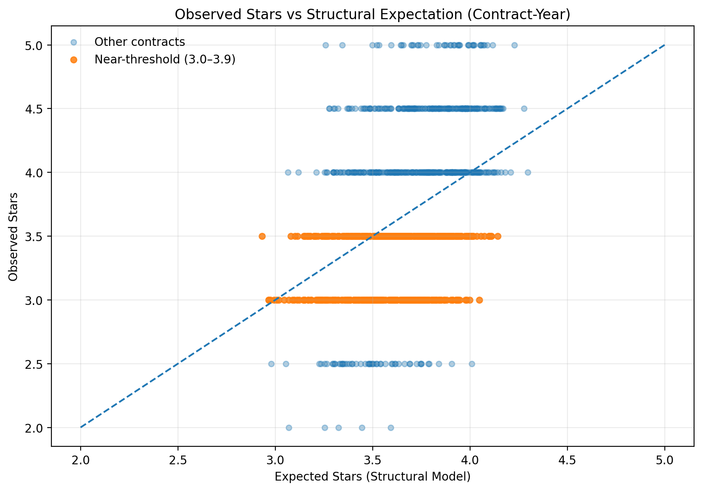
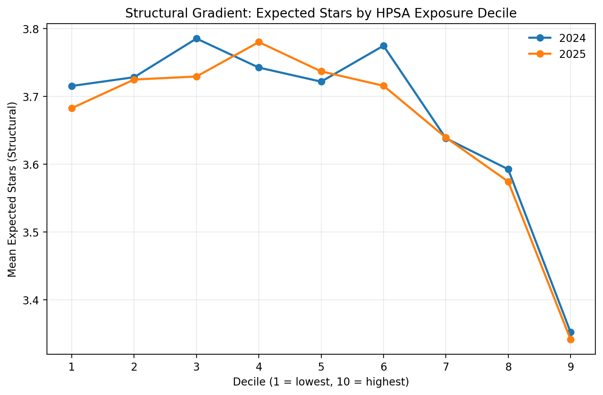
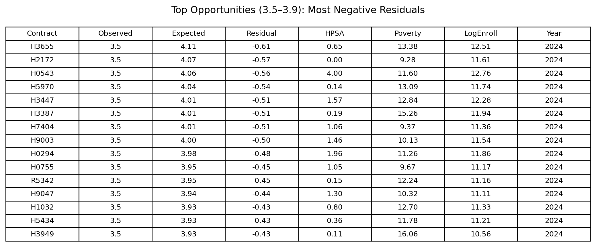

# Medicare Advantage Stars: Structural Exposure & Near-Threshold Risk Modeling

**Author:** Carlos Perez  
**Project Type:** Medicare Advantage Performance Analytics Portfolio  
**Environment:** Python | DuckDB | CMS & HRSA Public Data  
**Date:** February 2026  

---

## Executive Summary

Medicare Advantage (MA) Star Ratings are assigned at the contract level and directly influence benchmark bonuses, rebate percentages, and competitive positioning. Because the Star system contains discrete rating thresholds—particularly the 4.0 cut point—small performance changes near these boundaries can carry disproportionate financial impact.

This project builds a contract-level framework that separates:

- **Structural expectation** (baseline performance shaped by measurable environmental context)
- **Performance gap** (observed results relative to structural expectation)

The objective is not predictive maximization, but economically aligned segmentation anchored to the 4-star bonus threshold. By isolating structural context from operational deviation, the framework identifies near-threshold contracts where improvement focus may carry material financial sensitivity.

This shifts Star interpretation from raw score comparison to context-adjusted portfolio prioritization.

Fully reproducible via: `python run_all.py`

---

## Business Problem

Star Ratings aggregate performance across heterogeneous markets. Contracts operate under materially different structural environments:

- Provider access constraints  
- Enrollment scale differences  
- Geographic dispersion  
- County benchmark variation  

Applying uniform expectations across these environments obscures whether results reflect contextual headwinds or actionable performance gaps.

The strategic question becomes:

> Which contracts near economically meaningful thresholds are underperforming relative to their structural position?

---

## Conceptual Framework

Each contract’s observed Star Rating is decomposed into:

### 1. Structural Expectation  
Modeled baseline performance given measurable contextual drivers.

### 2. Performance Gap  
Observed Star − Structural Expectation

- Positive Gap → Performing above context  
- Negative Gap → Performing below context  

This decomposition supports context-aware benchmarking while preserving interpretability.

---

## Structural Drivers

| Driver | Rationale | Data Source |
|--------|-----------|------------|
| Provider Access Exposure (HPSA) | Access constraints influence quality closure and care coordination | CMS + HRSA |
| Enrollment Scale (log) | Scale affects infrastructure and statistical stability | CMS Enrollment Files |
| Geographic Concentration | Dispersion affects operational complexity | CMS County-Level Enrollment |
| Market Composition | Benchmark variation influences performance baseline | CMS Rate Book |

Drivers were intentionally selected for interpretability rather than maximum statistical complexity.

---

## Analytical Environment

- Python-based ETL pipeline  
- DuckDB contract-level aggregation  
- Reproducible SQL transformations  
- Scripted figure generation  
- Structured export of modeling artifacts  

---

## Run the Pipeline

1. Clone the repository
```
git clone https://github.com/carlospereztx/ma-stars-structural-modeling.git
cd ma-stars-structural-modeling
```

2. Create a virtual environment
```python
-m venv .venv
```
3. Activate the virtual environment
```
.venv\Scripts\activate
```
4. Install dependencies
```
pip install --upgrade pip
pip install -r requirements.txt
```
5. Run the pipeline:
```
python run_all.py
```

---
## Pipeline Architecture


---

## Methodology Overview

1. Stage CMS Star & enrollment files  
2. Construct structural exposure variables  
3. Estimate structural expectation (linear specification)  
4. Compute contract-level performance gaps  
5. Identify near-threshold contracts (3.5–3.9 band)  
6. Export prioritization artifacts and figures  

The objective is segmentation clarity, not predictive precision.

---

## Key Outputs

### Structural Alignment

Observed Star Ratings demonstrate systematic alignment with structural expectation, confirming contextual relevance.

### Within-Band Dispersion

Contracts sharing identical Star categories exhibit materially different performance gaps.

### Structural Gradients

- Higher HPSA exposure → lower expected Stars  
- Larger enrollment scale → higher expected baseline  

### Prioritized Opportunity List

Near-threshold contracts ranked by most negative performance gap for portfolio targeting.

---

## Sample Figures

These artifacts are generated automatically in `reports/figures/`.

### Structural vs Observed Scatter



### HPSA Exposure Gradient



### Near-Threshold Opportunity Table



---

## Project Structure

```
ma-stars-project/
├── requirements.txt
├── README.md
├── db/
│   └── ma_stars.duckdb
├── src/
│   ├── 01_stage_stars.py
│   ├── 02_check_star_summary.py
│   ├── 03_stage_enrollment.py
│   ├── 04_inspect_enrollment.py
│   ├── 05_build_weights.py
│   ├── 06_stage_saipe_poverty_api.py
│   ├── 07_build_poverty_exposure.py
│   ├── 08_build_near_threshold_analysis.py
│   ├── 09_threshold_stats.py
│   ├── 10_stage_rural_rucc.py
│   ├── 11_build_rural_exposure.py
│   ├── 12_build_threshold_with_rural.py
│   ├── 13_threshold_logit_structural.py
│   ├── 14_model_full_stars.py
│   ├── 15_stage_hpsa.py
│   ├── 16_build_hpsa_exposure.py
│   ├── 17_export_report_artifacts.py
│   └── 18_make_report_figures.py
├── reports/
│   ├── figures/
│   └── tables/
├── data_raw/        # excluded from Git
├── data_staged/
└── scripts/        # ad hoc inspection utilities (not part of core pipeline)
```

---

## Reproducibility

This repository is fully reproducible via a single command.

### 1. Create and activate a virtual environment


```bash
python -m venv venv
.\venv\Scripts\activate
```

###Install Dependencies
```bash
pip install -r requirements.txt
```

###Run the pipeline:

```bash
python run_all.py
```

###All tables will be rebuilt in:
```
db/ma_stars.duckdb
```

Outputs will be generated in:

```
reports/figures/
reports/tables/
```

Raw CMS and HRSA data files are excluded from the repository and must be sourced independently.

---

## Data Sources

- CMS Medicare Advantage Star Ratings (Public Use Files)
- CMS Contract-County Enrollment Files
- HRSA Health Professional Shortage Area (HPSA) Data
- U.S. Census Bureau SAIPE Poverty Estimates
- USDA Rural-Urban Continuum Codes (RUCC)

All data are publicly available and contract-level outputs are reproducible via the pipeline.

## Strategic Implications

- Raw Star comparison obscures contextual heterogeneity  
- Structural adjustment clarifies interpretive fairness  
- Near-threshold segmentation aligns quality improvement with economic sensitivity  
- Framework supports portfolio-level prioritization without prescribing operational tactics  

Primary contribution: **context-adjusted segmentation clarity rather than prediction maximization**

---

## Limitations

- Model prioritizes interpretability over maximal explanatory complexity  
- Does not attribute performance gaps to specific operational levers  
- Excludes certain compositional variables (e.g., risk score mix, dual eligibility) intentionally  

---

## Project Goals

This project demonstrates:

- CMS quality program fluency  
- Contract-level aggregation logic  
- Structural vs operational decomposition  
- Threshold sensitivity modeling  
- Reproducible healthcare analytics pipeline design  
- Strategic performance segmentation  

---

Carlos Perez  
Medicare Advantage Structural Analytics Framework  
github.com/carlospereztx
